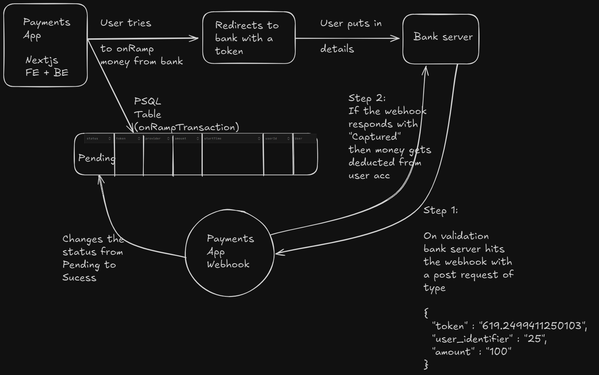
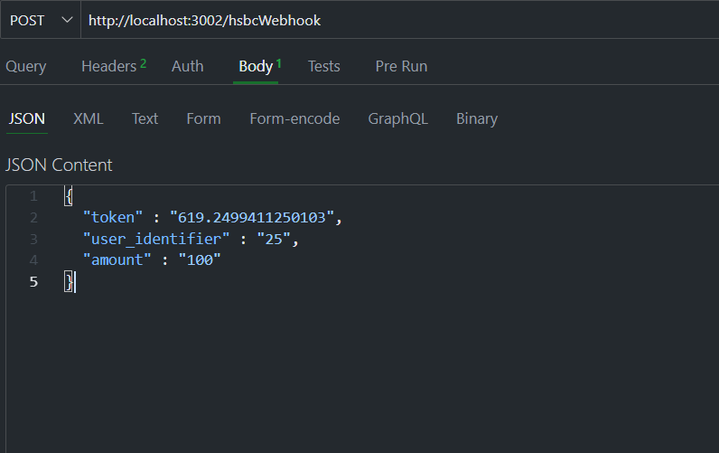

# Payments App

A third part payments app in which a user can send money to someone or on ramp/ off ramp from/to the bank.

- [user-app](https://payments-app-user-app-latest.onrender.com)
- [web-hook](https://urban-shrew-ayush272002-deea4b3e.koyeb.app)

## Tech Stack

- Nextjs
- Expressjs
- Tailwind
- PostgreSQL
- Prisma ORM
- Docker
- CI/CD for deployemnt of image to docker hub

## Workflow



## Running the project locally

```shell
git clone https://github.com/Ayush272002/Payments-App.git
cd Payments-App
```

There is a [docker-compose.yml](./docker-compose.yml) in each of the services fill in the environment variables after that in the project's root dir run

```shell
docker-compose up
```

Note:-

When on ramping money you will be directed to a bank webpage(will build a bank project later and interlink both of them) and it'll generate a token in the database with a status of pending. So to test that you need to hit the webhook with a post request
Body of the psot request for the webhook



if it responds with captured that means transaction completed.

## Contributing

Contributions are welcome! If you have suggestions for new features, bug fixes, or improvements, please fork the repository and submit a pull request. For major changes, please open an issue first to discuss what you would like to change.

## License

This project is licensed under the MIT License - see the [LICENSE](LICENSE) file for details.

## Contact

If you have any questions or suggestions, please feel free to contact.
